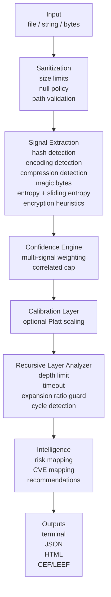

# CryptoTrace

[](https://github.com/parv68/CryptoTrace/actions/workflows/ci.yml)
[](LICENSE)
[](Cargo.toml)

CryptoTrace is an open-source **cryptographic fingerprinting and data classification engine**.

Give it a suspicious file, a blob of bytes, or a string.
CryptoTrace classifies what it most likely is.

Examples of classifications:
- Hashes (MD5, SHA-1, SHA-256, bcrypt, Argon2, NTLM, PBKDF2 variants)
- Encodings (Base64, Hex, Base32, Base58, Ascii85, Z85, Base91, URL encoding)
- Compression formats (GZIP, Zstd, XZ, BZ2, Brotli, LZ4, ZIP)
- File formats (magic-byte registry for common formats and subtypes)
- High-entropy payloads and likely encryption heuristics

CryptoTrace does not decrypt.
It does not claim certainty.
It explains what it sees, how confident it is, and why.

Air-gapped by default.
Network features are opt-in.

## Table Of Contents

1. What This Project Solves
2. What CryptoTrace Is (And Isn't)
3. Who It's For
4. Quick Start
5. How It Works (Architecture)
6. Feature Tour
7. CLI Reference
8. Output Schema
9. Configuration Reference
11. Security Model
12. Threat Intel (Opt-In)
13. SIEM Integration (CEF/LEEF)
14. Reports (JSON/HTML)
15. Signature Database and Updates
16. Calibration (Confidence Model)
17. Testing, Fuzzing, and Quality Gates
18. Packaging and Distribution (v1 Plan)
19. Development
20. Troubleshooting
21. Project Status and Roadmap
22. Contributing
23. License

## What This Project Solves

In real security work you regularly encounter unknown data:
- A blob inside a PowerShell script
- A base64-looking string in logs
- A file that "isn't opening" but has a recognizable header
- A suspicious attachment that might be a packed payload
- A credential dump with mixed hash formats

You want answers fast:
- What is this likely to be
- Is it wrapped in layers
- Is it weak crypto
- Is it safe to handle
- Can I pipe it into a pipeline and get deterministic output

CryptoTrace is built to answer those questions with:
- deterministic signals
- conservative heuristics
- explainability
- safety guardrails

## What CryptoTrace Is (And Isn't)

CryptoTrace is:
- A classifier and signal aggregator
- A forensic assistant for triage
- A safe-by-default analyzer for attacker-controlled inputs

CryptoTrace is not:
- A decryption tool
- A malware sandbox
- A substitute for full reverse engineering

CryptoTrace is honest about limitations:
- High entropy does not mean encryption
- Many encodings and packers are custom
- Malware can evade common detectors

## Who It's For

CryptoTrace is designed for:
1. SOC analysts
2. incident responders
3. malware researchers
4. forensic engineers
5. security auditors
6. students learning crypto formats and payload hygiene

## Quick Start

### Install (one command, any OS)

**Option 1 — With Rust installed:**
```bash
cargo install cryptotrace
```

**Option 2 — macOS:**
```bash
brew install parv68/tap/cryptotrace
```

**Option 3 — Linux / macOS (no Rust):**
```bash
curl -sSfL https://github.com/parv68/CryptoTrace/releases/latest/download/install.sh | sh
```

**Option 4 — Windows (PowerShell, no Rust):**
```powershell
powershell -c "iwr https://github.com/parv68/CryptoTrace/releases/latest/download/install.ps1 | iex"
```

### Verify
```bash
cryptotrace version
```

### Analyze A String
```bash
cryptotrace analyze "5f4dcc3b5aa765d61d8327deb882cf99" --explain
```

### Analyze A File
```bash
cryptotrace analyze suspicious.bin --deep --sandbox
```

### JSON Output
```bash
cryptotrace analyze suspicious.bin --json
```

## How It Works (Architecture)

CryptoTrace turns an input into signals.
Signals become a confidence score.
Confidence becomes an explainable decision.
Optionally, CryptoTrace unwraps layers.



Safety guardrails are non-negotiable:
- max file size
- max recursion depth
- max recursion time
- max expansion ratio
- worker isolation

## Feature Tour

This section is a practical overview.
Details are later in the README.

### 1. Hash Detection

CryptoTrace detects common hashes.
It also avoids false positives where formats overlap.

Examples:
- UUID vs MD5 disambiguation
- NTLM vs generic 32-hex strings
- whitespace stripping for command output formats

### 2. Encoding Detection

CryptoTrace detects common encodings.
It attempts decode to verify.
It uses confidence scoring rather than yes/no.

### 3. Compression Detection

CryptoTrace detects compression by magic bytes and by trying to decompress.
It enforces hard limits to avoid decompression bombs.

### 4. Entropy Analysis

CryptoTrace computes Shannon entropy.
CryptoTrace also computes sliding-window entropy.

Why sliding windows matter:
- malware payloads are often embedded inside low-entropy wrappers
- a single global entropy value can hide embedded regions

### 5. Recursive Layer Unwrapping

CryptoTrace can unwrap nested layers.
Common patterns:
- Base64 over GZIP
- Base64 over ZIP
- multi-layer encodings

Guards:
- depth limit
- time limit
- expansion ratio limit
- cycle detection

### 6. Explainability

CryptoTrace does not just output a score.
It outputs:
- signal breakdown
- primary drivers
- conflicting signals
- a decision trace

### 7. Threat Intel (Opt-In)

CryptoTrace can optionally query VirusTotal.
CryptoTrace can optionally run YARA scans.

These are opt-in.
Air-gapped operation remains the default.

### 8. Reports

CryptoTrace can emit:
- JSON (machine-readable)
- HTML (human-readable)

### 9. SIEM Output

CryptoTrace provides CEF and LEEF line formatters.
They are designed for ingestion in SOC pipelines.

## CLI Reference

The CLI is implemented in `src/cli.rs`.
Run:

```bash
cryptotrace --help
cryptotrace analyze --help
```

### `cryptotrace analyze`

Synopsis:

```bash
cryptotrace analyze <input>
  --context forensics|malware|password
  --deep
  --json
  --explain
  --ai
  --sandbox
```

Arguments:
- `<input>`

`<input>` can be:
- a literal string
- a file path

Flags:
- `--context`
- `--deep`
- `--json`
- `--explain`
- `--ai`
- `--sandbox`

Examples:

```bash
cryptotrace analyze "aGVsbG8=" --explain
cryptotrace analyze suspicious.bin
cryptotrace analyze suspicious.bin --deep --explain
cryptotrace analyze suspicious.bin --deep --sandbox --json
cryptotrace analyze "8846F7EAEE8FB117AD06BDD830B7586C" --context password --explain
```

### `cryptotrace update`

Synopsis:

```bash
cryptotrace update
cryptotrace update --rollback
cryptotrace update --from-file <bundle> --verify <sig>
```

Notes:
- Updates are verified.
- Rollback is supported.
- Air-gap import is supported.

### `cryptotrace version`

```bash
cryptotrace version
```

### `cryptotrace cache`

```bash
cryptotrace cache clear    # Clear AI narrative cache
cryptotrace cache status   # Show cache capacity and entry count
```

### `cryptotrace config show`

```bash
cryptotrace config show
```

### `cryptotrace calibrate`

Subcommands:
- `generate`
- `train`
- `status`

Examples:

```bash
cryptotrace calibrate generate --samples 200 --output calibration_data/train.csv
cryptotrace calibrate train --data calibration_data/train.csv
cryptotrace calibrate status
```

## Output Schema

The canonical output struct is `DetectionResult` in `src/types.rs`.

Key fields:
- `detected_type`
- `algorithm`
- `confidence`
- `calibrated`
- `risk_level`
- `weakness_cve`
- `signals`
- `primary_drivers`
- `conflicting_signals`
- `decision_trace`
- `layers`

Example JSON (abridged for readability):

```json
{
  "input_hash": "...",
  "source_type": "String",
  "entropy": 3.8,
  "detected_type": "hash",
  "algorithm": "MD5",
  "confidence": 0.98,
  "calibrated": true,
  "risk_level": "Critical",
  "weakness_cve": ["CVE-2013-6623"],
  "signals": {
    "entropy": 0.87,
    "block_alignment": 0.0,
    "magic_bytes": 0.0,
    "length_pattern": 1.0,
    "charset_purity": 1.0,
    "window_variance": 0.0
  },
  "primary_drivers": ["length_pattern", "charset_purity"],
  "conflicting_signals": [],
  "decision_trace": "...",
  "layers": []
}
```

## Configuration Reference

CryptoTrace reads `cryptotrace.toml` from the current directory.

Defaults are intentionally conservative.
AI remains disabled.

For full guidance:
- `docs/GETTING_STARTED.md`
- `docs/AIR_GAP_GUIDE.md`

## Security Model

CryptoTrace assumes inputs are adversarial.

### Sanitization

Examples of enforced policies:
- size limits
- null byte policy for strings
- safe path handling

### Recursive Unwrapping

Hard limits:
- `max_depth`
- `max_time_secs`
- `max_expansion_ratio`

### Decompression Bomb Defense

If decompression expands beyond 100:1, CryptoTrace aborts extraction.

### Subprocess Isolation

The `cryptotrace-worker` binary runs risky parsing operations.
If it crashes, the parent remains alive.

### Air Gap Defaults

No network calls happen unless you opt in.
Threat intel and AI features require explicit configuration.

See `SECURITY.md` for reporting policy.

## Threat Intel (Opt-In)

Threat intel is implemented in `src/intelligence/threat_intel.rs`.

Features:
- VirusTotal v3 queries (requires API key)
- YARA CLI scanning (requires yara installed)

These are off by default.

## SIEM Integration (CEF/LEEF)

SIEM formatting is implemented in `src/intelligence/siem.rs`.

Available functions:
- `format_cef(&DetectionResult) -> String`
- `format_leef(&DetectionResult) -> String`

These are intended for integrations where CryptoTrace is embedded.

## Reports (JSON/HTML)

HTML report generation lives in `src/reports/html.rs`.
JSON is the canonical output of the engine and API.

## Signature Database and Updates

Signature registry:
- magic bytes
- risk mapping
- CVE mapping in `signatures/cve_map.yaml`

Updates:
- verification
- provenance log
- rollback
- air-gap import

## Calibration (Confidence Model)

Calibration lives in `src/core/calibration.rs`.

The model file lives in:
- `calibration_data/model.json`

The CLI supports training.
Confidence can be calibrated or provisional.

## Testing, Fuzzing, and Quality Gates

CryptoTrace uses:
- unit tests
- integration tests
- accuracy tests
- fuzz targets

Run tests:

```bash
cargo test
```

Fuzzing:
- requires nightly
- long fuzz runs are recommended on Linux

Commands:

```bash
make fuzz
make fuzz-long
bash scripts/fuzz-long.sh
```

## Packaging and Distribution

CryptoTrace is distributed through:

| Method | Command |
|--------|---------|
| **crates.io** | `cargo install cryptotrace` |
| **Homebrew** | `brew install parv68/tap/cryptotrace` |
| **GitHub Releases** | Pre-built binaries for Linux, macOS, Windows |

Install scripts:

```bash
# Linux / macOS
curl -sSfL https://github.com/parv68/CryptoTrace/releases/latest/download/install.sh | sh

# Windows PowerShell
powershell -c "iwr https://github.com/parv68/CryptoTrace/releases/latest/download/install.ps1 | iex"
```

## Development

Common commands:

```bash
cargo build
cargo build --release
cargo fmt
cargo clippy --all-targets -- -D warnings
cargo test
```

## Troubleshooting

### "worker not found" errors

If you use `--sandbox`, ensure `cryptotrace-worker` is on PATH.
If building from source, build both binaries.

### Windows fuzzing

Long fuzz runs are recommended on Linux.

## Project Status

Current status:
- core engine implemented
- tests and safety guardrails implemented
- packaging (crates.io, Homebrew, GitHub Releases)
- release automation

## Contributing

See `CONTRIBUTING.md`.
See `CODE_OF_CONDUCT.md`.
See `SECURITY.md`.

## License

Apache-2.0.
See `LICENSE`.
